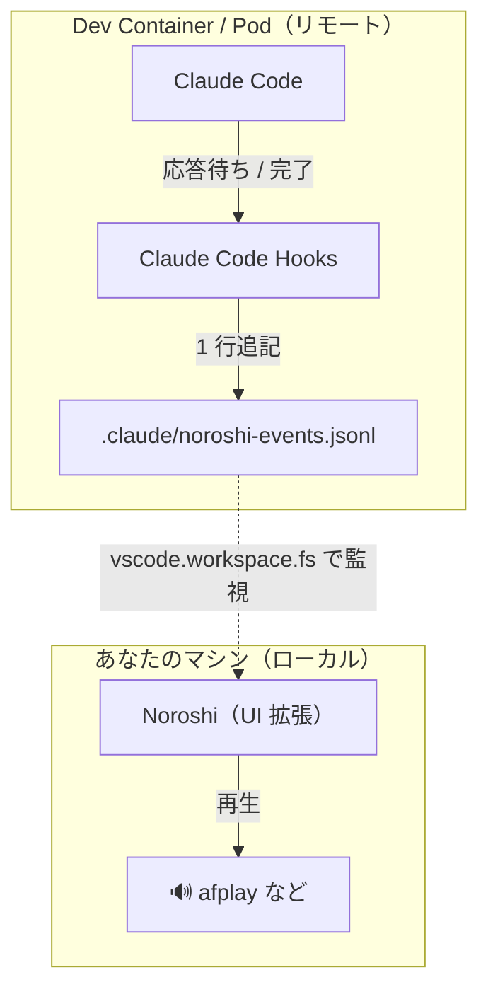

# Noroshi

Claude Code の「応答待ち」「処理完了」を、手元（ローカル）の効果音で知らせる VSCode 拡張。
Claude Code が Dev Container（ローカルの Docker コンテナや Kubernetes Pod）の中で動いていても鳴ります。

English version: [README.md](README.md)

## 特徴

- 🔊 Claude Code が入力を待っているとき、応答を終えたときに効果音で通知します。
- 📦 **Claude Code が Dev Container / Kubernetes Pod の中で動いていても、音は手元のマシンで鳴ります。** ローカル専用の通知ツールとの一番の違いです。
- 🖥️ Claude Code の VSCode 拡張版（サイドパネル）と、統合ターミナルの `claude` の両方に対応。
- 🎚️ 効果音や再生コマンドを差し替えられ、鳴らすタイミング（セッション種別で絞る／ウィンドウにフォーカス中は鳴らさない）も調整できます。
- 🌐 macOS / Linux / Windows に対応。

## 仕組み

Claude Code を Dev Container の中で動かしているとき、Claude Code Hooks が動くのは**コンテナ側**です。しかし音は**ホストマシン**で鳴らす必要があり、両者は直接やり取りできません。そこで Noroshi はファイルを介して両者を橋渡しします。フックが各イベントをリモートワークスペース内のファイルに記録し、ホスト側で動く Noroshi がそのファイルを監視します。



Claude Code のフックが、リモート側のイベントファイル（`.claude/noroshi-events.jsonl`）に 1 行追記します。
Noroshi は `extensionKind: ["ui"]` として**手元のマシンで動く**ため、`afplay` などのローカルコマンドで音を鳴らせます。
このリモートのファイルをワークスペースのファイルシステム経由で監視し、新しい行が現れた瞬間に音を鳴らします。

## セットアップ

### 1. Noroshi をインストールする

[VSCode Marketplace](https://marketplace.visualstudio.com/items?itemName=mtgto.noroshi) から **Noroshi** をインストールします。拡張パネル（macOS: `⌘⇧X` / Windows・Linux: `Ctrl+Shift+X`）を開いて **Noroshi** を検索し、**インストール** をクリック。`mtgto.noroshi` を直接指定してもかまいません。

Noroshi は `["ui"]` 拡張なので、**手元（UI）側**にインストールされます。これが Remote Container 用途で狙いどおりの動きです。

### 2. フックをインストールする

VSCode の**コマンドパレット**（macOS: `⌘⇧P` / Windows・Linux: `Ctrl+Shift+P`）を開き、**Noroshi: Install Claude Code Hooks** を実行します（`Noroshi` のステータスバーをクリックしてメニューから *Install Claude Code Hooks* を選んでもかまいません）。ワークスペースの `.claude/settings.json` または `.claude/settings.local.json` にフックを追加します。

書き込み先:

- `.claude/settings.local.json` があればそこへ書きます。Noroshi は個人の好みの設定であり、このファイルは通常 git 管理外のためです。
- どちらのファイルも無ければ `.claude/settings.json` を作成します。
- `.claude/settings.json` だけがある場合は、どちらに書くかを尋ねます。

既存のフックは残します。ファイルは上書きではなくマージされ、Noroshi に必要なエントリだけが追加されます。二度実行しても何も起きません。設定ファイルが正しい JSON でない場合は一切書き換えず、その旨を通知します。

### 3. 動作を確認する

これでセットアップは完了です。Claude Code の VSCode 拡張版に「Hello」など何か話しかけて、応答が返ったときに手元で音が鳴れば成功です。

ステータスバーの `🔊 Noroshi` はフックを検出済みの合図です（`⚠️ Noroshi` はまだ未設定）。音が鳴らないときは [既知の制約](#既知の制約) を参照してください。

## 使い方

`Noroshi` のステータスバーをクリックする（またはコマンドパレットから **Noroshi: Show Menu** を実行する）と、メニューが開きます。ここから「フックをインストール」「セットアップ手順を開く」「有効／無効の切り替え」「出力ログを表示」「設定を開く」を選べます。

## 設定

| 設定 | 既定 | 説明 |
|---|---|---|
| `noroshi.enabled` | `true` | 有効／無効 |
| `noroshi.eventsFile` | `.claude/noroshi-events.jsonl` | 監視ファイル（相対=ワークスペース基準 / 絶対=Pod 絶対パス） |
| `noroshi.sounds.notification` / `.stop` | `""` | 音声上書き（空=同梱 WAV） |
| `noroshi.playerCommand` | `""` | 再生コマンド。`${file}` を置換。空=OS 既定 |
| `noroshi.pollInterval` | `3000` | 安全網ポーリング（ms）。0 で無効 |
| `noroshi.debounceMs` | `250` | 同種イベント連打の抑制窓（ms） |
| `noroshi.entrypointFilter` | `[]` | 例 `["claude-vscode"]` で拡張版セッションのみ再生 |
| `noroshi.suppressWhenFocused` | `false` | この VSCode ウィンドウがフォーカスされている間は鳴らさない |
| `noroshi.statusBar.show` | `true` | ステータスバーを表示 |

`eventsFile` / `playerCommand` / `sounds.*` はローカルコマンドの実行やローカルファイルの操作につながるため、[VSCode Workspace Trust](https://code.visualstudio.com/docs/editor/workspace-trust) の対象になっています。信頼されていないワークスペースでは、これらのワークスペース／フォルダ単位の上書き設定は無視され、ユーザー設定または既定値にフォールバックします（Noroshi 自体はその既定値で通常どおり動作を続けます）。

### 音声フォーマット

同梱の既定は WAV（全 OS の既定コマンドが再生できる形式）です。`sounds.*` には任意フォーマットのパスを指定できます（再生できるかは `playerCommand` 次第）。macOS では `afplay` は mp3/m4a も再生できます。

### OS 別の既定再生コマンド

`playerCommand` は argv トークンに分割してそのまま実行されます（**シェルを経由しません**）。そのため `${file}` は、パスにスペースや特殊文字が含まれていても 1 つのリテラル引数として渡されます。`${file}` を自分で引用符で囲む必要はありません（テンプレート内の引用符は、下記の `-c` 引数のようにスペースを含むトークンをまとめるためだけに使われます）。

- macOS: `afplay ${file}`
- Linux: `paplay ${file}`（無ければ `aplay`）
- Windows: `powershell -NoProfile -c "(New-Object Media.SoundPlayer ${file}).PlaySync()"`（WAV のみ）

## 応用

### 特定のセッション種別だけ鳴らす（entrypoint）

統合ターミナルの `claude` では鳴らさず、拡張版（サイドパネル）のセッションだけ鳴らしたい場合は、拡張の entrypoint 値を `noroshi.entrypointFilter` に設定します。サイドパネルの値は `claude-vscode` です。

```json
"noroshi.entrypointFilter": ["claude-vscode"]
```

この値が合わなくなった場合は、判別子を自分で実測できます（[CONTRIBUTING.ja.md](CONTRIBUTING.ja.md#entrypoint-の判別子を実測する) を参照）。

### フックを手で書く

上記の **Install Claude Code Hooks** を使ったなら不要で、自分で設定したい場合のためのものです。`.claude/settings.json` に以下を追加します（`noroshi.eventsFile` を変えた場合は追記先パスも合わせてください）。

```json
{
  "hooks": {
    "Notification": [
      {
        "hooks": [
          {
            "type": "command",
            "command": "printf '{\"event\":\"notification\",\"entrypoint\":\"%s\"}\\n' \"${CLAUDE_CODE_ENTRYPOINT:-unknown}\" >> \"$CLAUDE_PROJECT_DIR/.claude/noroshi-events.jsonl\"  # noroshi"
          }
        ]
      }
    ],
    "Stop": [
      {
        "hooks": [
          {
            "type": "command",
            "command": "printf '{\"event\":\"stop\",\"entrypoint\":\"%s\"}\\n' \"${CLAUDE_CODE_ENTRYPOINT:-unknown}\" >> \"$CLAUDE_PROJECT_DIR/.claude/noroshi-events.jsonl\"  # noroshi"
          }
        ]
      }
    ]
  }
}
```

フックは command 文字列の完全一致で判定します。そのため `noroshi.eventsFile` を変えてから再度インストールすると、古いファイルを指すエントリが残ります。Noroshi は自分のものと断定できないエントリを削除しないためです。気になる場合は手で消せます。残っていても、誰も監視していないファイルに追記するだけで実害はありません。

### 既知の制約

- **VSCode 拡張版では、`Notification` フックに Claude Code 2.1.233 以降が必要です。** それ以前は拡張版でこのフックが発火しませんでした（[anthropics/claude-code#8985](https://github.com/anthropics/claude-code/issues/8985)、最初の報告は [#16114](https://github.com/anthropics/claude-code/issues/16114)）。2.1.233 で許可プロンプトについて修正されています。2.1.266 の拡張版で、ツール実行の許可ダイアログ（Write）、`AskUserQuestion` の選択ダイアログ、サンドボックスの「ネットワーク接続を許可しますか?」ダイアログのいずれでも発火することを実機検証済みです。Claude Code を上げられない場合は、`PermissionRequest` も併用して拡張版に対応していた Noroshi **v0.1.0** を使ってください。
- **拡張版では、放置しても音が鳴りません。** 「Claude is waiting for your input」の `idle_prompt` 通知はターミナル CLI では飛びますが、拡張版では 2.1.266 でも飛ばず、Noroshi に届くものがありません。許可プロンプトと `Stop` は影響を受けません。
- **v0.1.0 から更新すると `PermissionRequest` のエントリが残ります。** v0.1.0 はこれをインストールしており、Noroshi はフックのエントリを削除しないため（上記の注記を参照）そのまま残り、許可プロンプトのたびに約6秒後にもう一度音が鳴ります。`debounceMs` では到底吸収できない間隔です。`.claude/settings.json` や `.claude/settings.local.json` から手で削除してください。

## 開発に参加する

ローカル開発（F5 デバッグ、VSIX のビルド、テスト実行、手動スモークテスト）については [CONTRIBUTING.ja.md](CONTRIBUTING.ja.md) を参照してください。
