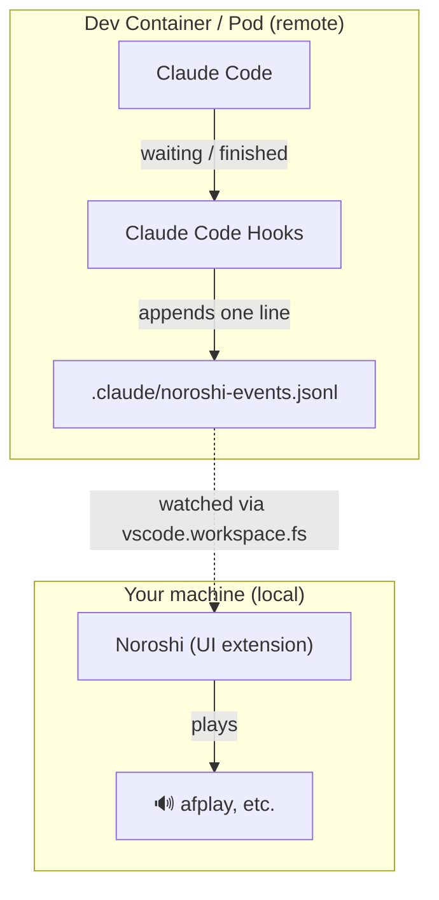

# Noroshi

A VSCode extension that plays a local sound when Claude Code is **waiting for
you** or has **finished** — even when Claude Code runs inside a Dev Container,
whether that container is a local Docker container or a Kubernetes Pod.

日本語版は [README.ja.md](README.ja.md) を参照してください。

## Features

- 🔊 Plays a sound when Claude Code is waiting for your input or has finished
  responding.
- 📦 **Works even when Claude Code runs in a Dev Container / Kubernetes Pod** —
  the sound still plays on your local machine. This is what sets Noroshi apart
  from local-only notifiers.
- 🖥️ Supports both the Claude Code VSCode extension (side panel) and the
  integrated-terminal `claude` CLI.
- 🎚️ Customizable: choose your own sounds and playback command, and control
  *when* it plays (by session type, or stay silent while the window is focused).
- 🌐 Cross-platform — macOS, Linux, and Windows.

## How it works

When Claude Code runs inside a Dev Container, its hooks fire **inside the
container** — but the sound has to play on your **host machine**, and the two
sides can't call each other directly. So Noroshi bridges them through a file:
the hook records each event into a file in the remote workspace, and Noroshi,
running on the host, watches that file.



A Claude Code hook appends one line to an events file on the remote
(`.claude/noroshi-events.jsonl`). Noroshi declares `extensionKind: ["ui"]`, so it
**runs on your local machine** — which is what lets it play local commands like
`afplay`. It watches that remote file through the workspace file system and plays
a sound the moment a new line appears.

## Setup

### 1. Install Noroshi

Install **Noroshi** from the [VSCode Marketplace](https://marketplace.visualstudio.com/items?itemName=mtgto.noroshi):
open the Extensions panel (`⌘⇧X` on macOS, `Ctrl+Shift+X` on Windows/Linux),
search for **Noroshi**, and click **Install** — or install `mtgto.noroshi`
directly.

Because Noroshi is a `["ui"]` extension, it installs on your **local (UI)** side,
which is exactly what the Remote Container use case needs.

### 2. Install the hooks

Open the VSCode **Command Palette** (`⌘⇧P` on macOS, `Ctrl+Shift+P` on
Windows/Linux) and run **Noroshi: Install Claude Code Hooks** (or click the
`Noroshi` status bar item and pick *Install Claude Code Hooks*). It adds the
hooks to this workspace's `.claude/settings.json` or `.claude/settings.local.json`
for you.

Where it writes:

- If `.claude/settings.local.json` exists, it goes there — Noroshi is a personal
  preference and that file is normally untracked by git.
- If neither file exists, `.claude/settings.json` is created.
- If only `.claude/settings.json` exists, you're asked which one to use.

Existing hooks are kept: the file is merged, not overwritten, and only the
entries Noroshi needs are added. Running it twice is a no-op. If the settings
file isn't valid JSON, Noroshi leaves it completely alone and tells you so.

### 3. Check that it works

That's it — setup is done. In the Claude Code VSCode extension, say something
like "Hello" and wait for the reply: you should hear a sound on your local
machine when it finishes.

The `🔊 Noroshi` status bar item means the hook was detected (`⚠️ Noroshi` means
it isn't configured yet). If you hear nothing, see [Known limitations](#known-limitations).

## Usage

Click the `Noroshi` status bar item (or run **Noroshi: Show Menu** from the
Command Palette) to open a menu where you can: install the hooks, open the setup
guide, enable/disable Noroshi, show the output log, and open Noroshi's settings.

## Settings

| Setting | Default | Description |
|---|---|---|
| `noroshi.enabled` | `true` | Enable/disable Noroshi |
| `noroshi.eventsFile` | `.claude/noroshi-events.jsonl` | File to watch (relative = workspace-based, absolute = an absolute path on the remote Pod) |
| `noroshi.sounds.notification` / `.stop` | `""` | Override sound (empty = bundled WAV) |
| `noroshi.playerCommand` | `""` | Playback command. `${file}` is substituted. Empty = OS default |
| `noroshi.pollInterval` | `3000` | Safety-net polling interval (ms). 0 disables it |
| `noroshi.debounceMs` | `250` | Suppression window (ms) for repeats of the same event |
| `noroshi.entrypointFilter` | `[]` | e.g. `["claude-vscode"]` to play only extension sessions |
| `noroshi.suppressWhenFocused` | `false` | Don't play a sound while this VSCode window is focused |
| `noroshi.statusBar.show` | `true` | Show the status bar item |

`eventsFile`, `playerCommand`, and `sounds.*` run a local command or touch a local
file, so they are restricted under [VSCode Workspace
Trust](https://code.visualstudio.com/docs/editor/workspace-trust): in an untrusted
workspace, a workspace/folder-level override of these is ignored, falling back to
the user/default value (which Noroshi keeps operating on normally).

### Audio format

The bundled defaults are WAV (a format every OS's default command can play). You
may point `sounds.*` at any format (playability depends on `playerCommand`). On
macOS, `afplay` also plays mp3/m4a.

### Default playback commands

`playerCommand` is split into argv tokens and run directly — **no shell** is
involved, so `${file}` is substituted as a single literal argument regardless of
spaces or special characters in the path. Quoting `${file}` yourself is unnecessary
(quotes in the template only group a token containing spaces, e.g. for the `-c`
argument below).

- macOS: `afplay ${file}`
- Linux: `paplay ${file}` (falls back to `aplay`)
- Windows: `powershell -NoProfile -c "(New-Object Media.SoundPlayer ${file}).PlaySync()"` (WAV only)

## Advanced

### Play only for one session type (entrypoint)

To play only for the extension (side panel) sessions and not for `claude` in the
integrated terminal, set the extension's entrypoint value into
`noroshi.entrypointFilter` — for the side panel that value is `claude-vscode`:

```json
"noroshi.entrypointFilter": ["claude-vscode"]
```

If that value ever stops matching, you can measure the discriminator yourself —
see [CONTRIBUTING.md](CONTRIBUTING.md#measuring-the-entrypoint-discriminator).

### Configuring the hook by hand

You don't need this if you used **Install Claude Code Hooks** above — it's only
for setting things up yourself. Add the following to `.claude/settings.json` (if
you change `noroshi.eventsFile`, update the append target to match):

```json
{
  "hooks": {
    "Notification": [
      {
        "hooks": [
          {
            "type": "command",
            "command": "printf '{\"event\":\"notification\",\"entrypoint\":\"%s\"}\\n' \"${CLAUDE_CODE_ENTRYPOINT:-unknown}\" >> \"$CLAUDE_PROJECT_DIR/.claude/noroshi-events.jsonl\"  # noroshi"
          }
        ]
      }
    ],
    "PermissionRequest": [
      {
        "hooks": [
          {
            "type": "command",
            "command": "printf '{\"event\":\"notification\",\"entrypoint\":\"%s\"}\\n' \"${CLAUDE_CODE_ENTRYPOINT:-unknown}\" >> \"$CLAUDE_PROJECT_DIR/.claude/noroshi-events.jsonl\"  # noroshi"
          }
        ]
      }
    ],
    "Stop": [
      {
        "hooks": [
          {
            "type": "command",
            "command": "printf '{\"event\":\"stop\",\"entrypoint\":\"%s\"}\\n' \"${CLAUDE_CODE_ENTRYPOINT:-unknown}\" >> \"$CLAUDE_PROJECT_DIR/.claude/noroshi-events.jsonl\"  # noroshi"
          }
        ]
      }
    ]
  }
}
```

Note that hooks are matched by their exact command, so if you change
`noroshi.eventsFile` and install again, the entry pointing at the old file stays
behind — Noroshi won't delete hook entries it might not own. Remove it by hand if
you want to tidy up; a stale entry only appends to a file nobody watches.

### Known limitations

- **As of Claude Code 2.1.207, the `Notification` hook does not fire in the
  Claude Code VSCode extension** — a later version may fix it. This stems from a
  known upstream bug where the extension's `processControlRequest()` had no
  handler for the `Notification` / `PermissionRequest` control-request subtypes
  (see [anthropics/claude-code#8985 (comment)](https://github.com/anthropics/claude-code/issues/8985#issuecomment-3798023834)
  for the root-cause analysis, and [#16114](https://github.com/anthropics/claude-code/issues/16114)
  for the original report). `PermissionRequest` **has since been fixed** and was
  confirmed working in the extension (also on 2.1.207) for both the
  tool-permission dialog (Write/Edit/Bash) and the `AskUserQuestion` dialog —
  this is the one that actually gets Noroshi its sound in the extension today.
  `Notification` is kept in the snippet anyway since it's harmless and still
  covers terminal CLI cases (like `idle_prompt`) that `PermissionRequest`
  doesn't.
- **The sandbox's "Allow network connection to this host?" dialog** (shown e.g.
  for `curl`) does not fire either hook, on appearance or after a choice is made
  — it appears to go through a separate, still-unhooked code path. There's
  currently no way for Noroshi to catch that one.

## Contributing

For local development (F5 debugging, building a VSIX, running tests, and the
manual smoke test), see [CONTRIBUTING.md](CONTRIBUTING.md).
